<h1 align="center">Hi  I'm Patrickson Mungai</h1>

<p align="center">
  
  <a href="https://github.com/kishankumar1328 /readme-typing-svg">
    
  </a>
</p>

<p align="center">
  <a href="https://git.io/typing-svg">
    
  </a>
</p>

---


---

## ABOUT ME

```javascript
const developer = {
  name: "Patrickson Mungai",
  currentlyWorking: "Building scalable web applications",
  lookingTo: "Collaborate on open-source projects",
  learning: ["DevOps", "GraphQL", "AI Automation"],
  funFact: "I code faster than my coffee kicks in ☕",
  contact: "Open for opportunities and collaborations!",
};
```

<p align="center">
  
</p>

---

## WHO DOESN'T LOVE PAC-MAN

<p align="center">
  <picture>
    <source media="(prefers-color-scheme: dark)" srcset="ASSETS/pacman-dark.svg" />
    <source media="(prefers-color-scheme: light)" srcset="ASSETS/pacman-light.svg" />
    
  </picture>
</p>
---

## GITHUB STATS

<p align="center">
  
  
</p>

<p align="center">
  
</p>

<p align="center">
  
  
  
</p>

<p align="center">
  
  
  
</p>

---

## TECH ARSENAL

```python
class TechStack:
    def __init__(self):
        self.languages = ["JavaScript", "Python", "C#", "TypeScript", "HTML", "CSS"]
        self.frameworks = ["React", "Node.js", "FastAPI", "Flask"]
        self.tools = ["Git", "GitHub", "Vercel", "Figma", "Docker", "MySQL", "PostgreSQL"]
        self.databases = ["MySQL", "PostgreSQL"]
```

<p align="center">
  
</p>

<p align="center">
  
  
  
  
  
  
</p>

<p align="center">
  
  
  
</p>

<p align="center">
  
  
  
  
  
  
  
</p>

<p align="center">
  
</p>

---

## MIMIC PYTHON 

<p align="center">
  <picture>
    <source media="(prefers-color-scheme: dark)" srcset="ASSETS/snake-dark.svg" />
    <source media="(prefers-color-scheme: light)" srcset="ASSETS/snake-light.svg" />
    
  </picture>
</p>

<p align="center">
  
</p>

---

## CONNECT WITH ME

<p align="center">
  <a href="https://www.linkedin.com/in/patrickson-mungai-a7a936280/" target="_blank">
    
  </a>
  <a href="https://www.instagram.com/" target="_blank">
    
  </a>
  <a href="mailto:thairupatrickson@gmail.com" target="_blank">
    
  </a>
  <a href="https://stackoverflow.com/users/32373204/patrickson-mungai" target="_blank">
    
  </a>
  <a href="https://discord.com" target="_blank">
    
  </a>
</p>

---

## QUOTE OF THE DAY IS!!!!!

<p align="center">
  
</p>

---

<p align="center">
  
</p>

<div align="center">
  <p>⭐️ From <a href="https://github.com/Patrickson2">Patrickson2</a> with 💜</p>
  <p>© 2024-2026 | Built with 💜 and lots of ☕</p>
</div>
